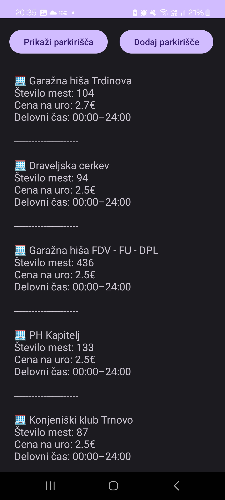
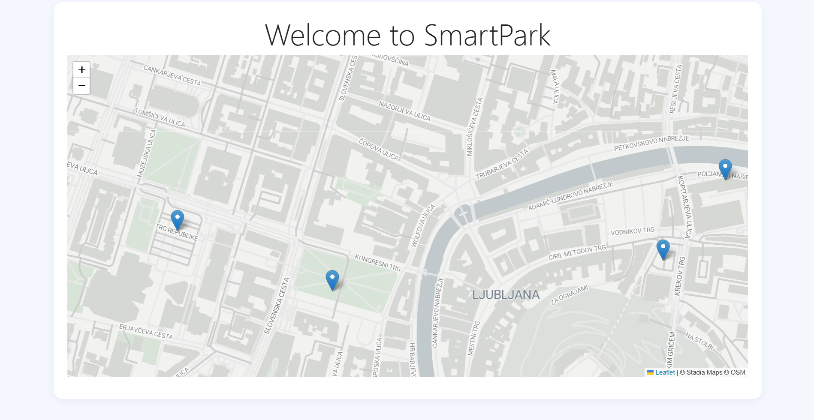
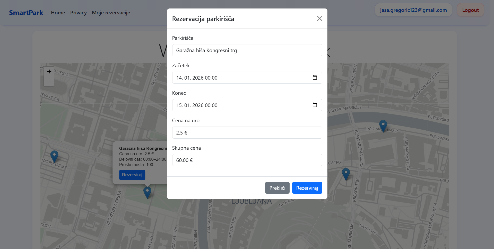
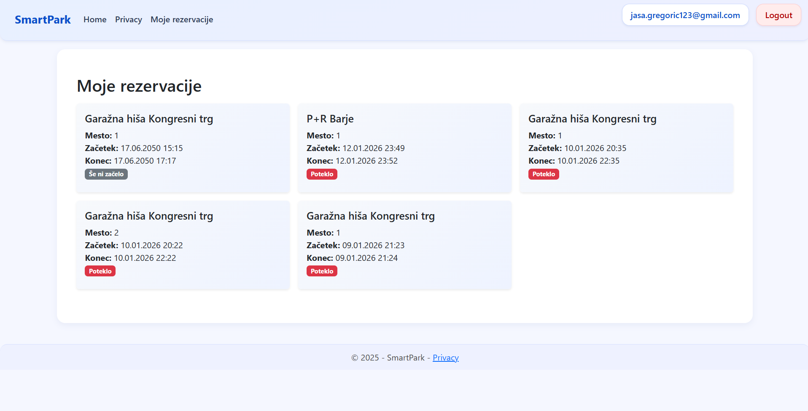

# SmartPark – Sistem za upravljanje parkirišč

## 📌 Avtorji
- **Jaša Gregorič 63240100**
- **Nihad Ajdaroski 63240003**

---

## 🖼️ Zaslonske slike
### Mobilna aplikacija
1. Seznam parkirišč  
   


2. Dodajanje prakirišča
   

### Spletna aplikacija
3. Domača stran z zemljevidom  
   

4. Rezervacija parkirišča  
   

5. Seznam rezervacij  
   


---

## 📝 Opis sistema
SmartPark je integriran sistem, ki povezuje **mobilno aplikacijo**, **spletno aplikacijo** in **.NET REST API**:

- **Mobilna aplikacija**: omogoča uporabnikom prijavo, pregled parkirišč na interaktivnem zemljevidu, rezervacijo in plačilo.  
- **Spletna aplikacija**: administratorski vmesnik za pregled rezervacij, upravljanje parkirišč in uporabnikov.  
- **REST API**: implementiran v ASP.NET Core, podpira CRUD operacije nad parkirišči in rezervacijami, vrača podatke v JSON formatu, dokumentiran s Swagger UI ter zaščiten z avtentikacijo (Identity + JWT).

---

## 👨‍💻 Prispevki študentov
- **Jaša**  
  - Implementacija REST API (CRUD za parkirišča in rezervacije).  
  - Integracija EF Core z Azure SQL.  
  - Swagger dokumentacija.  
  - Leaflet zemljevid v spletni aplikaciji.  

- **Soavtor 1**  
  - Razvoj mobilne aplikacije (UI, zemljevid, rezervacije).  
  - Integracija z API.  

- **Soavtor 2**  
  - Oblikovanje podatkovnega modela.  
  - Implementacija avtentikacije in avtorizacije (Identity, JWT).  
  - Testiranje in priprava poročila.  

---

## 🗂️ Podatkovni model


### Opis modela
- **Parkirisce**: vsebuje naslov, koordinate, ceno na uro in delovni čas.  
- **Rezervacija**: povezana s parkiriščem in uporabnikom, vsebuje čas začetka, trajanje in status.  
- **Uporabnik (Identity)**: vsebuje prijavne podatke in vloge (User/Admin).  

Relacije:
- `Parkirisce` 1—N `Rezervacija`  
- `Uporabnik` 1—N `Rezervacija`

---

## 🚀 Navodila za zagon
1. Kloniraj repozitorij:  
   ```bash
   git clone https://github.com/username/smartpark.git

-

## Opis aplikacije
SmartPark je spletna aplikacija, razvita v .NET ogrodju, ki omogoča prijavo in registracijo uporabnikov ter upravljanje parkirišč.  
Uporabniki lahko rezervirajo parkirna mesta, spremljajo razpoložljivost in izvajajo plačila.  
Podatki se shranjujejo v podatkovno bazo SQL Server, ki vsebuje vsaj pet tabel (uporabniki, parkirišča, parkirna mesta, rezervacije, plačila).  
Aplikacija je zasnovana kot primer uporabe konceptov MVC arhitekture, Entity Framework Core in Identity sistema.
