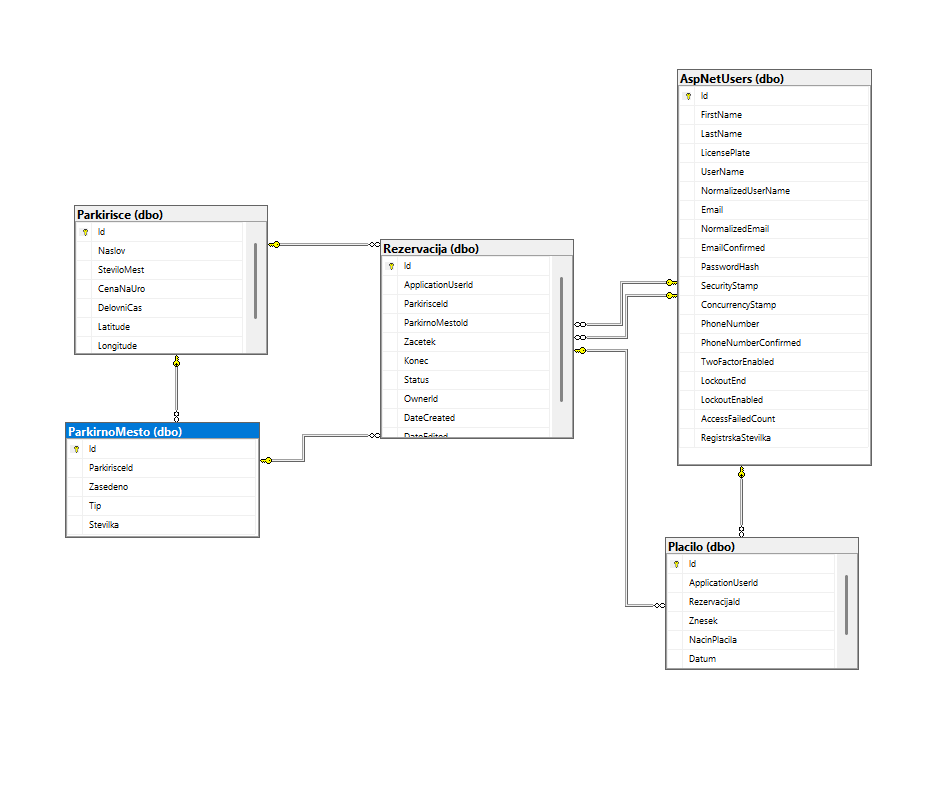

# SmartPark – Sistem za upravljanje parkirišč

## Avtorji
- **Jaša Gregorič 63240100**
- **Nihad Ajdaroski 63240003**

---

## Zaslonske slike
### Mobilna aplikacija
#### 1. Seznam parkirišč

#### 2. Dodajanje parkirišča

### Spletna aplikacija
3. Domača stran z zemljevidom  
   

4. Rezervacija parkirišča  
   

5. Seznam rezervacij  
   

---

## Opis sistema
SmartPark je integriran sistem, ki povezuje **mobilno aplikacijo**, **spletno aplikacijo** in **.NET REST API**:

- **Mobilna aplikacija**: omogoča uporabnikom pregled parkirišč in vnos novih parkirišč.  
- **Spletna aplikacija**: Omogoča uporabnikom prijavo, rezerviranje poljubnega parkirišča ter ogled njihovih rezervacij.  
- **REST API**: implementiran v ASP.NET Core, podpira CRUD operacije nad parkirišči, vrača podatke v JSON formatu, dokumentiran s Swagger UI.

---

## Prispevki študentov
- **Jaša**  
  - Integracija EF Core z Azure SQL.
  - Razvoj spletne aplikacija.
  - Načrt in vzpostavitev podatkovne baze.
  - Objava spletne strani.
  - Dokumentacija
  

- **Nihad**  
  - Razvoj mobilne aplikacije.  
  - Integracija z API.
  - Implementacija REST API.  
  - Swagger dokumentacija.
  - Leaflet zemljevid v spletni aplikaciji.

---

## Podatkovni model

### Opis podatkovnega modela

- **Parkirisce**  
  Vsebuje osnovne podatke o parkirišču: naslov, število mest, ceno na uro, delovni čas ter geografske koordinate (latitude, longitude).  

- **ParkirnoMesto**  
  Predstavlja posamezno parkirno mesto znotraj parkirišča. Vsebuje referenco na parkirišče, informacijo o zasedenosti, tip mesta in številko.  

- **Rezervacija**  
  Povezana je z uporabnikom, parkiriščem in konkretnim parkirnim mestom. Vsebuje čas začetka in konca, status rezervacije, lastnika ter metapodatke o ustvarjanju/urejanju.  

- **Uporabnik (AspNetUsers)**  
  Identity tabela, ki vsebuje prijavne podatke, osebne podatke (ime, priimek, registrska številka), kontaktne podatke ter varnostne nastavitve.  

- **Plačilo**  
  Povezano je z rezervacijo in uporabnikom. Vsebuje znesek, način plačila ter datum izvedbe.  

---

### Relacije

- `Parkirisce` 1—N `ParkirnoMesto`  
- `Parkirisce` 1—N `Rezervacija`  
- `ParkirnoMesto` 1—N `Rezervacija`  
- `Uporabnik (AspNetUsers)` 1—N `Rezervacija`  
- `Uporabnik (AspNetUsers)` 1—N `Plačilo`  
- `Rezervacija` 1—1 `Plačilo`

---

## Opis aplikacije
SmartPark je spletna aplikacija, razvita v .NET ogrodju, ki omogoča prijavo in registracijo uporabnikov ter upravljanje parkirišč. Uporabniki lahko rezervirajo parkirna mesta, spremljajo razpoložljivost in izvajajo plačila. Podatki se shranjujejo v podatkovno bazo SQL Server, ki vsebuje vsaj pet tabel (uporabniki, parkirišča, parkirna mesta, rezervacije, plačila). Aplikacija je zasnovana kot primer uporabe konceptov MVC arhitekture, Entity Framework Core in Identity sistema
